# lk - Ứng dụng Mạng Xã Hội Mini với Flask


**lk** là một ứng dụng mạng xã hội nhỏ gọn được phát triển bằng **Python** và **Flask**. Ứng dụng hỗ trợ các tính năng như đăng nhập bằng Google OAuth, đăng bài kèm ảnh, kết bạn, nhắn tin thời gian thực và gọi video.

---

[](https://lk-5db7.onrender.com)


🌐 **Truy cập ngay:** [https://lk-5db7.onrender.com](https://lk-5db7.onrender.com)

## ✨ Các Tính Năng Chính

### 1. Đăng Nhập / Đăng Ký
- **Đăng nhập/Đăng ký**: Đăng nhập bằng Google OAuth 2.0 (kèm ảnh đại diện) hoặc đăng ký bằng xác thực email.
- URL Callback Google: `http://127.0.0.1:5000/google/callback`

  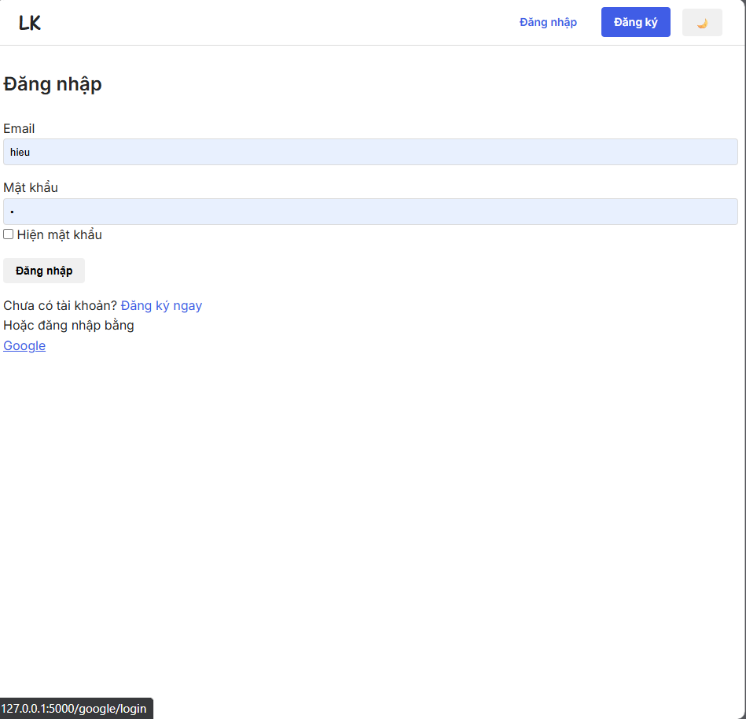  
  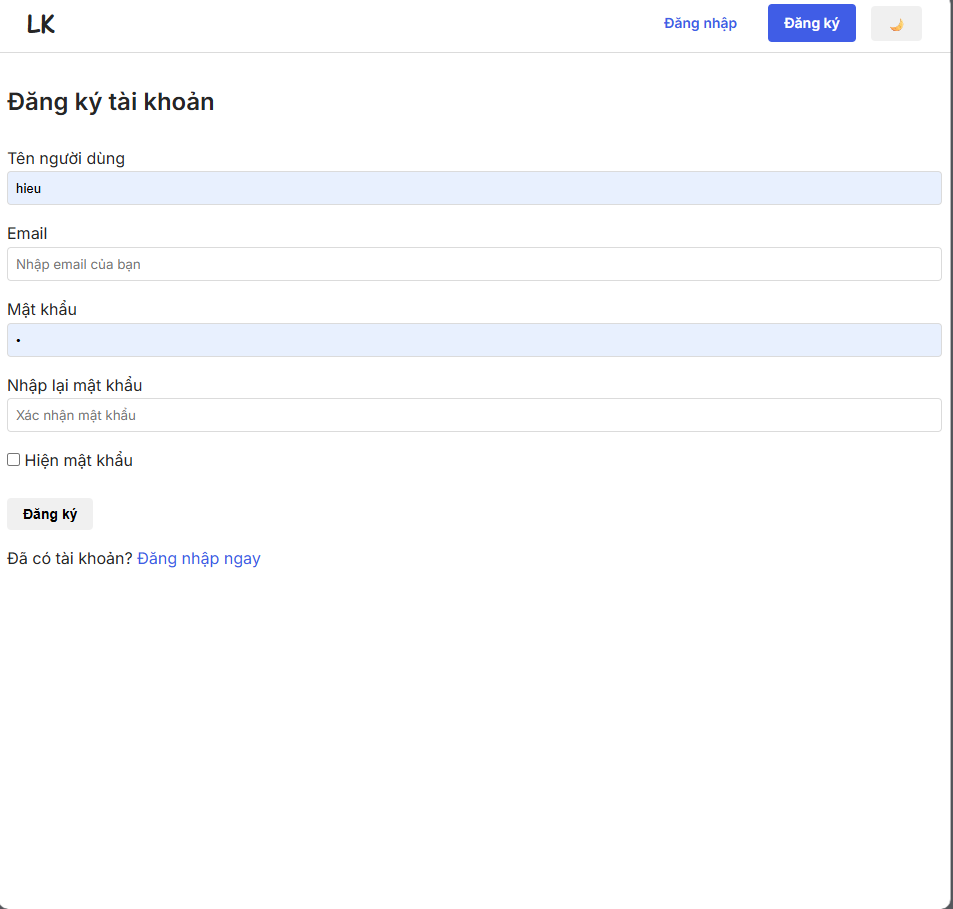

### 2. Trang Cá Nhân
- Quản lý thông tin cá nhân và ảnh đại diện.
- Xem bài viết và danh sách bạn bè.
- Thống kê tương tác.

  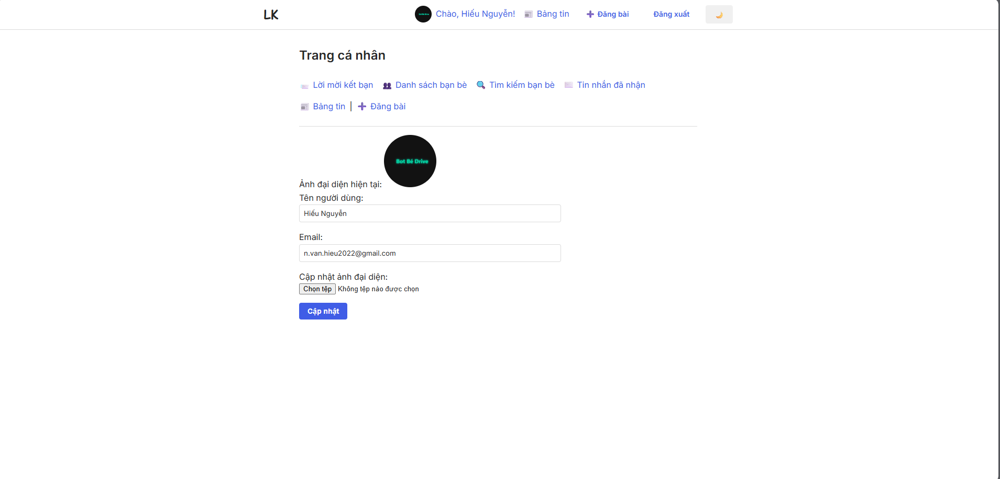

### 3. Bảng Tin
- Hiển thị bài viết theo thuật toán.
- Tương tác thích và bình luận.
- Bài viết nổi bật.

  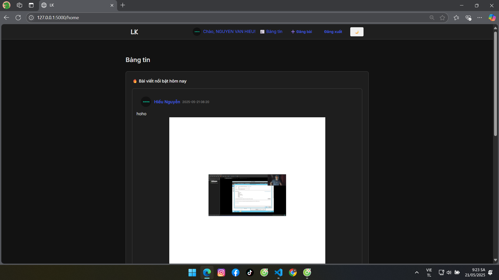

### 4. Đăng Bài Viết
- Chia sẻ bài viết kèm hình ảnh và định dạng văn bản phong phú.
- Gắn thẻ bạn bè trong bài viết.

  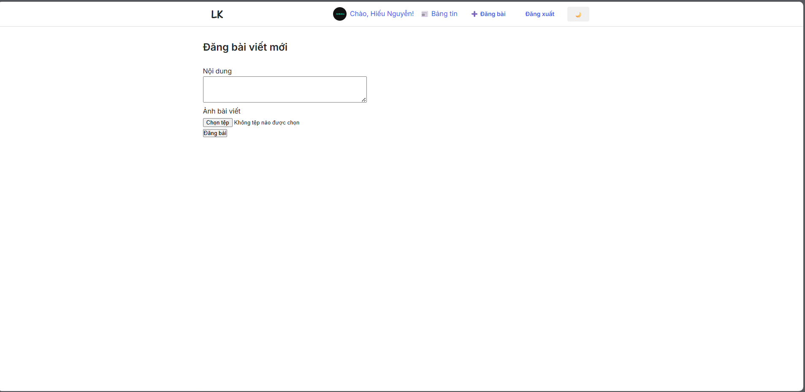

### 5. Tương Tác Bài Viết
- Bình luận và trả lời bình luận.
- Sử dụng biểu tượng cảm xúc.

  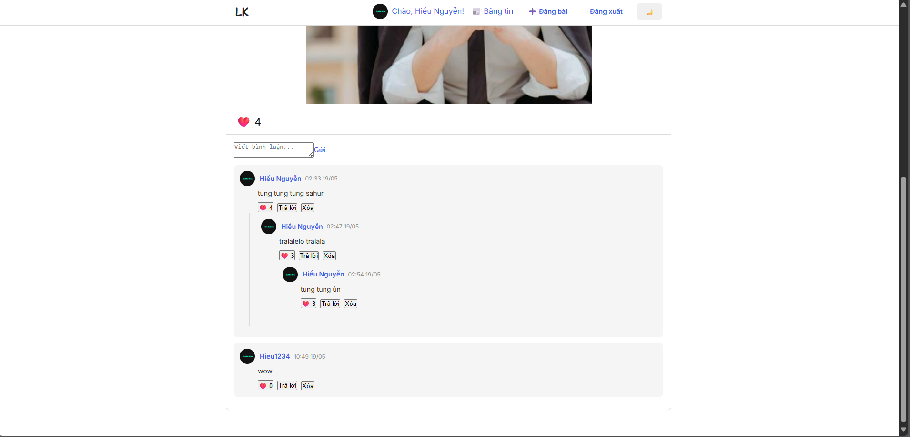

### 6. Kết Bạn
- Tìm kiếm bạn bè.
- Gửi và quản lý lời mời kết bạn.
- Xem danh sách bạn bè.

  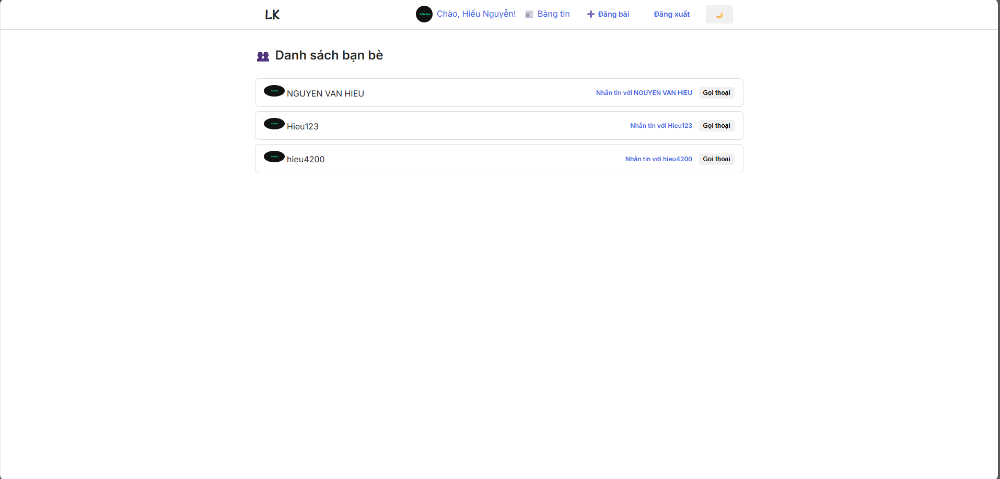  
  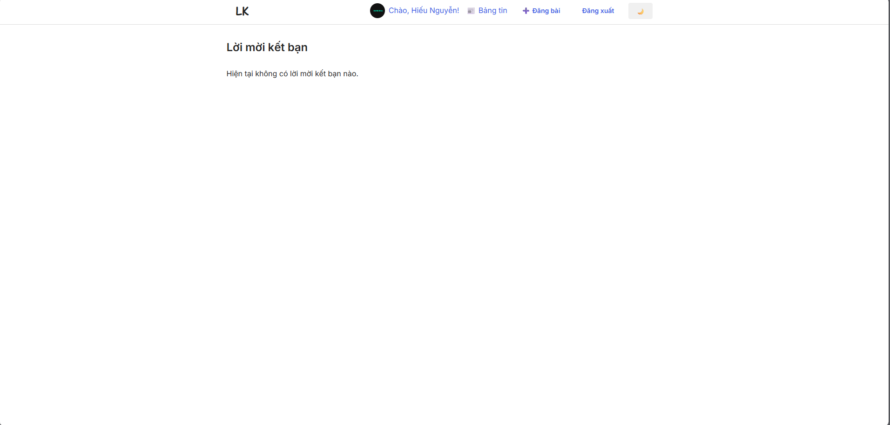

### 7. Nhắn Tin
- Trò chuyện thời gian thực với bạn bè.
- Gửi hình ảnh và tệp tin.
- Thông báo tin nhắn mới.

  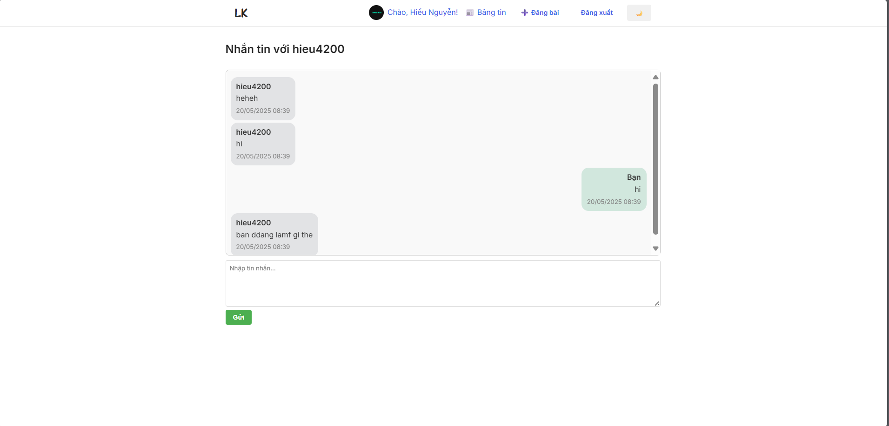

### 8. Gọi Video
- Gọi video trực tiếp với bạn bè.
- Chất lượng video HD.
- Tính năng chia sẻ màn hình.

  

### 9. Tìm Kiếm
- Tìm kiếm bài viết và người dùng.
- Bộ lọc tìm kiếm nâng cao.

  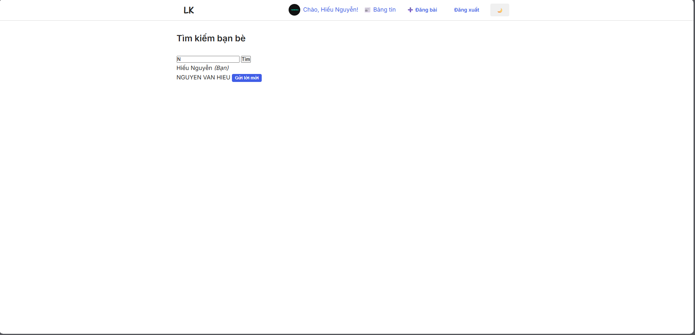  
  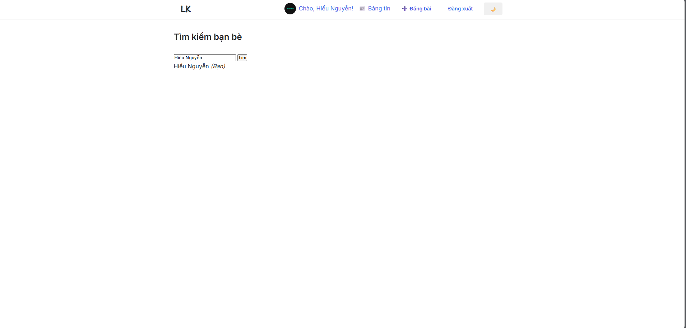

### 10. Quản Lý
- Bảng điều khiển quản trị để quản lý nội dung.
- Quản lý bài viết và bình luận.

  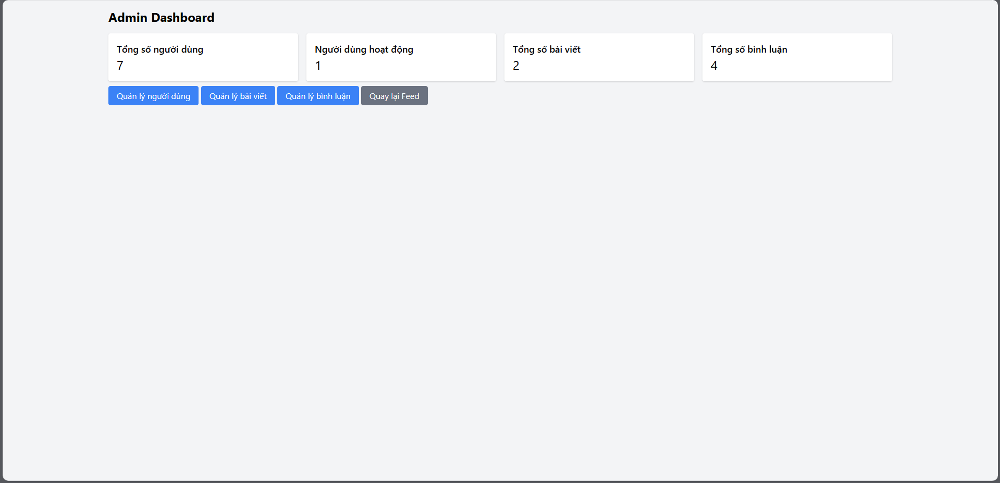  
  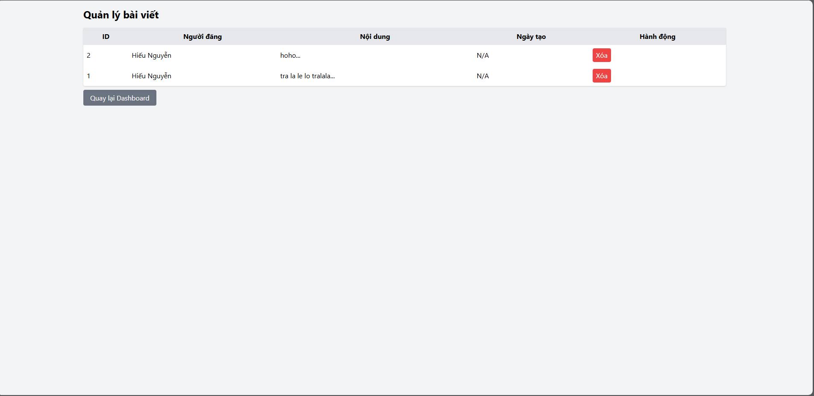  
  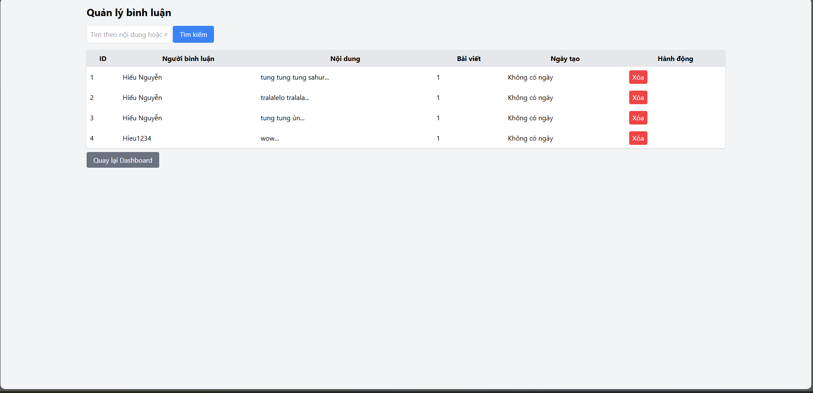

---

## 🛠️ Hướng Dẫn Cài Đặt

### 1. Tải Mã Nguồn
```bash
git clone https://github.com/hieuchaydi/lk-social.git
cd lk-social
```

### 2. (Tùy Chọn) Tạo Môi Trường Ảo
```bash
python -m venv venv
# Kích hoạt môi trường ảo:
source venv/bin/activate    # macOS/Linux
venv\Scripts\activate       # Windows
```

### 3. Cài Đặt Thư Viện
```bash
pip install -r requirements.txt
```

### 4. Thiết Lập Cơ Sở Dữ Liệu
```bash
flask db init
flask db migrate -m "Tạo cấu trúc cơ sở dữ liệu ban đầu"
flask db upgrade
```

> ⚠️ **Lưu ý**: Bỏ qua lệnh `flask db init` nếu cơ sở dữ liệu đã được khởi tạo trước đó.

### 5. Chạy Ứng Dụng
Chọn một trong hai cách sau:

#### Cách 1: Sử dụng `run.py`
```bash
python run.py
```

#### Cách 2: Sử dụng Flask CLI
```bash
flask run --host=0.0.0.0 --port=5000
```

### 6. Truy Cập Ứng Dụng
Mở trình duyệt và truy cập:
```
http://localhost:5000/
```

---

## 🔑 Thiết Lập Google OAuth

### 1. Tạo Dự Án trên Google Cloud Console
1. Truy cập [Google Cloud Console](https://console.cloud.google.com/).
2. Tạo dự án mới:
   - Nhấn vào menu dropdown ở góc trên bên trái → **New Project**.
3. Vào **APIs & Services** > **OAuth consent screen**:
   - Chọn loại người dùng **External**.
   - Cung cấp thông tin:
     - **Tên ứng dụng**: `My Flask App`
     - **Email hỗ trợ người dùng**: `your_email@gmail.com`
     - **Email liên hệ nhà phát triển**: `your_email@gmail.com`
     - **Logo**: (Tùy chọn)
   - Thêm **Authorized domains**: `127.0.0.1`
   - Thêm **Scopes**:
     - `email`
     - `profile`
     - `openid`
   - Lưu cài đặt.

### 2. Tạo OAuth Client ID
1. Vào **APIs & Services** > **Credentials**.
2. Nhấn **Create Credentials** → **OAuth Client ID**.
3. Chọn loại ứng dụng **Web application**.
4. Thêm **Authorized redirect URI**:
   ```
   http://127.0.0.1:5000/google/callback
   ```
5. Sau khi tạo, bạn sẽ nhận được:
   - **Client ID**: `your-client-id.apps.googleusercontent.com`
   - **Client Secret**: `your-client-secret`

### 3. Cấu Hình OAuth trong Ứng Dụng
Trong tệp `routes.py`, cập nhật cấu hình Google OAuth với thông tin của bạn:
```python
google = oauth.register(
    name='google',
    client_id='your-client-id',
    client_secret='your-client-secret',
    server_metadata_url='https://accounts.google.com/.well-known/openid-configuration',
    client_kwargs={
        'scope': 'openid email profile',
        'prompt': 'consent',
        'access_type': 'offline'
    }
)
```

---

## 🙌 Cảm Ơn Bạn Đã Sử Dụng lk!

Nếu bạn gặp vấn đề hoặc có đề xuất, vui lòng tạo issue trên [kho lưu trữ GitHub](https://github.com/hieuchaydi/lk-social).
